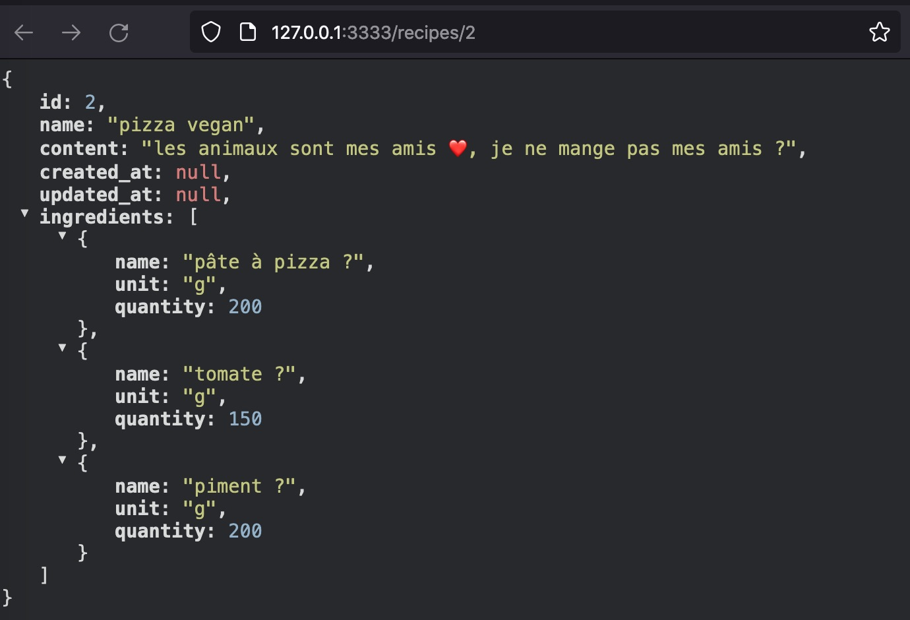
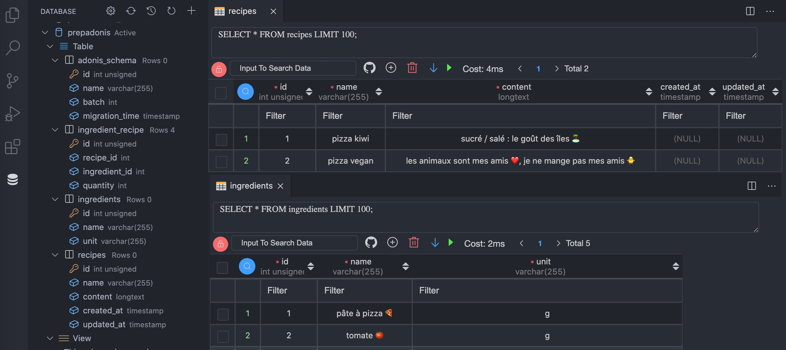
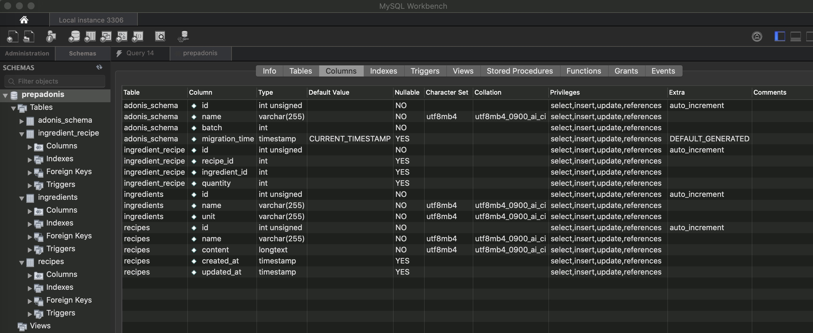

<h1 align="center">Welcome to my NodeJS / Adonis test 👋</h1>

### 🚀 [Watch the video live tuto from Grafikart](https://youtu.be/uP0cJfBiSb0)

> "LiveCoding NodeJS : Découverte d'Adonis".

### [Adonis JS](https://docs.adonisjs.com/guides/database/migrations#creating-your-first-migration)

> "A fully featured web framework for Node.js"

"AdonisJS includes everything you need to create a fully functional web app or an API server."

---

### Installation :
1. Create project

        nvm use v14.17.0

    &

        yarn create adonis-ts-app prepAdonis

    &

        cd prepAdonis

2. Install library

        yarn add @adonisjs/lucid@alpha

    &

        node ace invoke @adonisjs/lucid

3. Create database :

        mysql -u root -p --default-character-set=utf8 -e "CREATE DATABASE prepadonis;"

4. Run dev

        yarn run dev

    & open in your browser the server address :

        http://127.0.0.1:3333

> Database SQL : [structure & data](https://github.com/ipopop/nodejs-adonis-test/blob/main/tuto/_2021-08-26_103830_prepadonis_structure_and_datas.sql)

---

> Thank's to 'Jonathan' from 'Grafikart' for the tuto : https://youtu.be/uP0cJfBiSb0

---
## Author

👤 **eb-dev**

## Show your support

Give a ⭐️ if this project helped you!

## 📝 License

Copyright © 2021 [eb-dev](https://github.com/ipopop). 
This project is [MIT](https://en.wikipedia.org/wiki/MIT_License) licensed.

***
_This README was generated with ❤️ by [readme-md-generator](https://github.com/kefranabg/readme-md-generator)_
